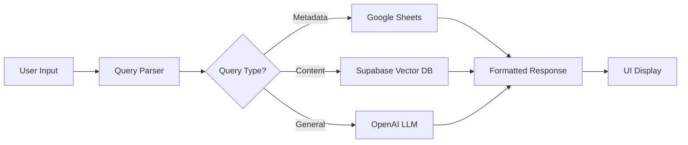

# 🎨 Diag-nose Research Assistant - Frontend Documentation
  
  **AI-Powered Nasal Biomarker Research Interface**
  
  *Streamlit-based web application for intelligent medical literature queries*
</div>

---

## 📋 **Table of Contents**
- [🎯 Overview](#-overview)
- [🛠️ Technology Stack](#️-technology-stack)
- [🎨 UI Components](#-ui-components)
- [🔧 Installation & Setup](#-installation--setup)
- [🚀 Running the Application](#-running-the-application)
- [💻 User Interface Guide](#-user-interface-guide)
- [🎨 Styling & Theming](#-styling--theming)
- [🔌 Integration Points](#-integration-points)
- [📱 Responsive Design](#-responsive-design)
- [🧪 Sample Queries](#-sample-queries)
- [🔧 Customization](#-customization)
- [📊 Performance](#-performance)
- [🐛 Troubleshooting](#-troubleshooting)

---

## 🎯 **Overview**

The Diag-nose Research Assistant frontend is a modern, responsive web application built with Streamlit that provides an intuitive interface for querying medical literature and research data. It combines the power of RAG (Retrieval-Augmented Generation) with a clean, professional UI designed specifically for healthcare researchers.

### **Key Features:**
- 🤖 **AI-Powered Chat Interface** - Natural language querying
- 📚 **Dual Data Source Integration** - Google Sheets + Vector Database
- 🎨 **Modern UI Design** - Clean, medical-professional aesthetic
- 📱 **Responsive Layout** - Works on desktop, tablet, and mobile
- ⚡ **Real-time Results** - Instant query processing with caching
- 🔍 **Smart Query Routing** - Automatic detection of query types
- 📊 **Rich Result Display** - Formatted responses with metadata

---

## 🛠️ **Technology Stack**

### **Frontend Framework:**
- **Streamlit 1.28+** - Main web framework
- **Python 3.8+** - Backend language

### **Styling & Design:**
- **CSS3** - Custom styling with modern design patterns
- **Responsive Design** - Mobile-first approach
- **Custom Components** - Enhanced Streamlit elements

### **AI & Data Integration:**
- **LangChain** - AI orchestration framework
- **OpenAI GPT Models** - Language understanding and generation
- **Supabase** - Vector database for document search
- **Google Sheets API** - Structured metadata queries

### **Performance & Caching:**
- **Streamlit Caching** - Resource and data caching
- **LRU Cache** - Query result caching
- **Lazy Loading** - Optimized resource loading

---

## 🎨 **UI Components**

### **1. Header Section**
```html
<!-- Responsive header with logo and branding -->
<div class="responsive-header">
  <div class="logo-container">
    
  </div>
  <div class="title-container">
    <h1 class="main-title">Research Assistant</h1>
    <p class="subtitle">AI-Powered Medical Literature Search</p>
  </div>
</div>
```

### **2. Chat Interface**
- **Message Bubbles:** Styled chat messages with glassmorphism effects
- **Input Field:** Modern rounded input with focus animations
- **Send Button:** Integrated submit functionality
- **Auto-scroll:** Automatic scrolling to latest messages

### **3. Sidebar Navigation**
- **Sample Queries:** Pre-built example questions
- **How to Use:** Interactive guidance
- **Clear Chat:** Session reset functionality
- **Settings:** Configuration options

### **4. Results Display**
- **Formatted Responses:** Rich text with proper formatting
- **Metadata Cards:** Source information display
- **Loading States:** Progress indicators
- **Error Handling:** User-friendly error messages

---

## 🔧 **Installation & Setup**

### **Prerequisites:**
```bash
# Python 3.8 or higher
python --version

# pip package manager
pip --version
```

### **1. Clone Repository:**
```bash
git clone <repository-url>
cd internal_LLM
```

### **2. Install Dependencies:**
```bash
pip install -r requirements.txt
```

### **3. Environment Configuration:**
Create a `.env` file in the project root:
```bash
# OpenAI Configuration
OPENAI_API_KEY=your_openai_api_key_here

# Supabase Configuration
SUPABASE_URL=your_supabase_url
SUPABASE_KEY=your_supabase_anon_key

# Google Sheets (Optional)
GOOGLE_SHEETS_CREDENTIALS=google-sheets-credentials.json
```

### **4. Google Sheets Setup (Optional):**
1. Create a Google Cloud Project
2. Enable Google Sheets API
3. Create service account credentials
4. Download credentials as `google-sheets-credentials.json`
5. Place in project root directory

---

## 🚀 **Running the Application**

### **Development Mode:**
```bash
# Start the Streamlit server
streamlit run agentic_RAG_streamlit.py

# With specific port
streamlit run agentic_RAG_streamlit.py --server.port 8501

# With custom configuration
streamlit run agentic_RAG_streamlit.py --server.headless true
```

### **Production Deployment:**
```bash
# Using Docker (if Dockerfile exists)
docker build -t diag-nose-frontend .
docker run -p 8501:8501 diag-nose-frontend

# Using cloud platforms
# Streamlit Cloud, Heroku, AWS, etc.
```

### **Access the Application:**
- **Local Development:** http://localhost:8501
- **Network Access:** http://your-ip:8501
- **Production:** Your deployed URL

---

## 💻 **User Interface Guide**

### **🏠 Home Page Layout**

```
┌─────────────────────────────────────────────────────────┐
│  [Logo] RESEARCH ASSISTANT                              │
│         AI-Powered Medical Literature Search           │
├─────────────────────────┬───────────────────────────────┤
│                         │                               │
│  📋 HOW TO USE         │                               │
│                         │                               │
│  Sample Queries:        │    💬 CHAT INTERFACE         │
│  1. Paper title query   │                               │
│  2. Author search       │    User: [Your question]     │
│  3. Methodology         │    AI: [Response]             │
│  4. Institution         │                               │
│                         │    ┌─────────────────────────┐ │
│  🗑️ Clear Chat          │    │ Ask your question...    │ │
│                         │    └─────────────────────────┘ │
│                         │                               │
└─────────────────────────┴───────────────────────────────┘
```

### **🎨 Visual Design Elements**

#### **Color Scheme:**
- **Primary:** `#27ae60` (Medical Green)
- **Secondary:** `#6c757d` (Professional Gray)
- **Background:** `#ffffff` (Clean White)
- **Accent:** `#e6f7f0` (Light Green)

#### **Typography:**
- **Headers:** Segoe UI, Bold, Uppercase
- **Body Text:** Segoe UI, Regular
- **Code/Data:** Monospace fonts

#### **Spacing & Layout:**
- **Container Max Width:** 1200px
- **Border Radius:** 18px (messages), 25px (inputs)
- **Shadows:** Subtle drop shadows with blur effects
- **Padding:** Consistent 20px spacing

---

## 🎨 **Styling & Theming**

### **CSS Architecture:**
The application uses a modular CSS approach with the following structure:

```css
/* 1. Base Styles */
.main, .stApp { /* Global app styling */ }

/* 2. Layout Components */
.responsive-header { /* Header layout */ }
.stSidebar { /* Sidebar styling */ }

/* 3. Interactive Elements */
.stChatMessage { /* Chat bubbles */ }
.stChatInput { /* Input fields */ }

/* 4. Responsive Design */
@media (max-width: 768px) { /* Mobile styles */ }
@media (min-width: 769px) { /* Tablet+ styles */ }
```

### **Glassmorphism Effects:**
```css
.stChatMessage {
    background: rgba(255, 255, 255, 0.9) !important;
    backdrop-filter: blur(5px) !important;
    border: 1px solid rgba(230, 243, 255, 0.2) !important;
    box-shadow: 0 4px 15px rgba(0, 0, 0, 0.05) !important;
}
```

### **Responsive Logo Implementation:**
```css
.responsive-header .logo-container {
    width: clamp(60px, 5vw, 90px);
    height: auto;
}

.responsive-header .fallback-logo {
    background: linear-gradient(135deg, #27ae60 0%, #2ecc71 100%);
    border-radius: 12px;
}
```

---

## 🔌 **Integration Points**

### **Backend APIs:**
1. **OpenAI API** - Language model queries
2. **Supabase API** - Vector database search
3. **Google Sheets API** - Metadata retrieval

### **Data Flow:**


### **State Management:**
- **Session State:** User chat history
- **Cache State:** Query results and metadata
- **Component State:** UI element states

---

## 📱 **Responsive Design**

### **Breakpoints:**
- **Mobile:** < 768px
- **Tablet:** 769px - 1024px  
- **Desktop:** > 1024px

### **Mobile Optimizations:**
```css
@media (max-width: 768px) {
    .responsive-header {
        flex-direction: column;
        text-align: center;
        gap: 12px;
    }
    
    .stSidebar {
        margin: 10px;
        border-radius: 15px;
    }
}
```

### **Touch-Friendly Elements:**
- **Minimum Touch Target:** 44px × 44px
- **Finger-Friendly Spacing:** 20px+ between elements
- **Swipe Gestures:** Supported where applicable

---

## 🧪 **Sample Queries**

### **Metadata Queries:**
```
1. "What is the corresponding author of the paper 'Differences of the Nasal Microbiome and Mycobiome by Clinical Characteristics of COPD Patients'?"

2. "Who wrote the paper about 'Clara cell protein in nasal lavage fluid and nasal nitric oxide'?"

3. "What is the sampling method for 'Comparative Analysis of Nasosorption and Sponge Sampling Methods'?"
```

### **Content Queries:**
```
1. "What diseases have been studied in relation to the nasal microbiome and mycobiome of COPD patients?"

2. "How does the nasal fungal mycobiome vary with different clinical characteristics in COPD patients?"

3. "Tell me about nasal fluid cytokine profiling methods"
```

### **Publication Queries:**
```
1. "Papers from 2014"
2. "Research from University of California"  
3. "Studies published in PLoS ONE"
```

---

## 🔧 **Customization**

### **Modifying Colors:**
```css
/* In style.css */
:root {
    --primary-color: #27ae60;
    --secondary-color: #6c757d;
    --background-color: #ffffff;
    --accent-color: #e6f7f0;
}
```

### **Adding New Components:**
```python
# In agentic_RAG_streamlit.py
def custom_component():
    st.markdown("""
    <div class="custom-component">
        <!-- Your HTML here -->
    </div>
    """, unsafe_allow_html=True)
```

### **Extending Functionality:**
```python
# Add new query types
def handle_custom_query(query):
    # Custom logic here
    return result

# Add to query router
if "custom_keyword" in query.lower():
    return handle_custom_query(query)
```

---

## 📊 **Performance**

### **Optimization Features:**
- ⚡ **Query Caching:** LRU cache for repeated queries
- 🔄 **Resource Caching:** Streamlit @cache decorators
- 🎯 **Lazy Loading:** Components loaded on demand
- 📦 **Efficient Bundling:** Optimized asset loading

### **Performance Metrics:**
- **Initial Load:** < 3 seconds
- **Query Response:** < 2 seconds (cached: < 0.5s)
- **UI Interaction:** < 100ms
- **Memory Usage:** < 500MB typical

### **Monitoring:**
```python
# Built-in performance tracking
@st.cache_data(ttl=3600)
def expensive_operation():
    # Cached for 1 hour
    pass

# Query timing
import time
start_time = time.time()
result = process_query(query)
processing_time = time.time() - start_time
```

---

## 🐛 **Troubleshooting**

### **Common Issues:**

#### **🚫 "Missing Environment Variables"**
```bash
# Solution: Check .env file
cat .env
# Ensure all required variables are set
```

#### **🔌 "Google Sheets Authentication Failed"**
```bash
# Solution: Verify credentials file
ls -la google-sheets-credentials.json
# Check file permissions and content
```

#### **🎨 "CSS Not Loading"**
```python
# Solution: Clear Streamlit cache
streamlit cache clear
# Or restart the application
```

#### **📱 "Mobile Layout Issues"**
```css
/* Solution: Check responsive CSS */
@media (max-width: 768px) {
    /* Add mobile-specific styles */
}
```

### **Debug Mode:**
```bash
# Run with debug logging
streamlit run agentic_RAG_streamlit.py --logger.level=debug
```

### **Error Logging:**
```python
# Built-in error handling
try:
    result = process_query(query)
except Exception as e:
    st.error(f"Query failed: {str(e)}")
    st.info("Please try a different query or contact support.")
```

---

## 🤝 **Contributing**

### **Frontend Development:**
1. **Setup Development Environment**
2. **Follow Code Style Guidelines**  
3. **Test Responsive Design**
4. **Update Documentation**

### **Code Style:**
- **Python:** PEP 8 compliance
- **CSS:** BEM methodology
- **Comments:** Clear, descriptive comments

### **Testing:**
```bash
# Test responsive design
streamlit run agentic_RAG_streamlit.py --server.port 8501
# Open in multiple browser sizes

# Test functionality
# Manual testing of all query types
```

---

## 📞 **Support**

### **Documentation:**
- 📖 **Main README:** System overview and setup
- 🎨 **Frontend README:** This document
- 🔧 **API Documentation:** Backend integration guide

### **Contact:**
- 🐛 **Bug Reports:** Create GitHub issues
- 💡 **Feature Requests:** Submit enhancement proposals  
- 📧 **Support:** Contact development team

---

<div align="center">

**🚀 Ready to explore medical research with AI-powered precision!**

*Built with ❤️ for healthcare researchers and medical professionals*

</div>
